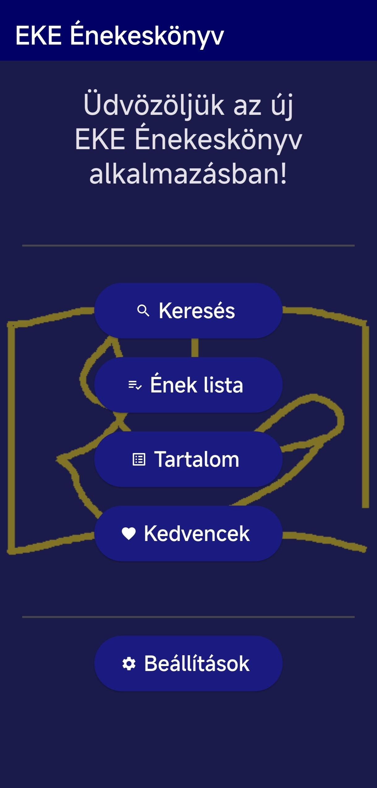
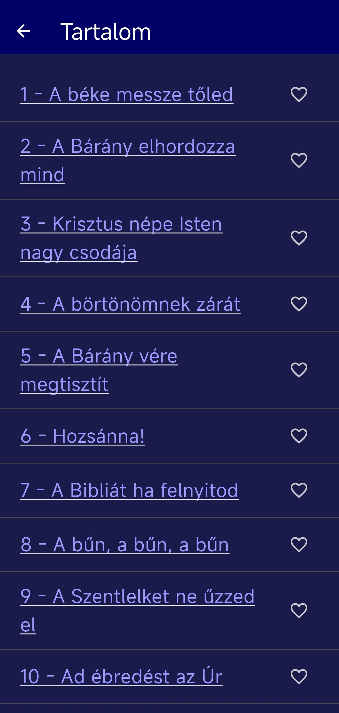

# 🎵 EKE Énekeskönyv

[](https://flutter.dev/)
[](https://dart.dev/)

**EKE Énekeskönyv** is a modern, cross-platform hymnbook application built with Flutter. It provides an easy-to-use interface for browsing, searching, and viewing hymns with sheet music support.

---

## ✨ Key Features

- 📂 **Song Library**: Browse a comprehensive collection of hymns stored in JSON format.
- 🔍 **Powerful Search**: Quickly find songs by title, number, or content.
- 🎼 **Sheet Music Viewer**: High-quality display of song scores (kották).
- 📜 **Playlists**: Organize your favorite songs into custom lists for quick access.
- 🌓 **Dark Mode Support**: Comfortably view songs in any lighting condition with adaptive themes.
- ⚙️ **Persistent Settings**: Your preferences (like theme mode) are saved across sessions.

---

## 📱 Screenshots

| Home Screen | Song View | Settings | Content |
| :---: | :---: | :---: | :---: |
|  |  |  |  |

---

## 🛠️ Tech Stack

- **Framework**: [Flutter](https://flutter.dev/)
- **State Management**: [Provider](https://pub.dev/packages/provider)
- **Local Storage**: [Shared Preferences](https://pub.dev/packages/shared_preferences)
- **Theming**: Material 3

---

## 🚀 Getting Started

### Prerequisites

- [Flutter SDK](https://docs.flutter.dev/get-started/install) (version ^3.8.1)
- [Android Studio](https://developer.android.com/studio) or [VS Code](https://code.visualstudio.com/) with Flutter extensions.

### Installation

1. **Clone the repository**:
   ```bash
   git clone https://github.com/yourusername/eke_enekeskonyv_app.git
   cd eke_enekeskonyv_app
   ```

2. **Install dependencies**:
   ```bash
   flutter pub get
   ```

3. **Run the app**:
   ```bash
   flutter run
   ```

### Building for Release

To generate a shareable APK:
```bash
flutter build apk --release
```
The APK will be located at `build/app/outputs/flutter-apk/app-release.apk`.

---

## 📂 Project Structure

- `lib/pages/`: Contains all UI screens (Home, Search, Song View, etc.).
- `lib/providers/`: State management logic using Provider.
- `assets/data/`: JSON database of songs.
- `assets/images/kottak/`: Sheet music image assets.

---

## 🤝 Contributing

Contributions are welcome! If you find a bug or have a feature request, please open an issue or submit a pull request.

---

Developed with ❤️ for the EKE community.

Android download: 
https://drive.google.com/file/d/1uTaYeNfDMlbQhGEwoaKnJzoakSGaynbo/view?usp=sharing
